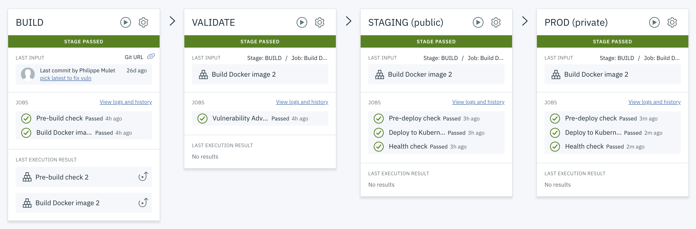

# IBM Cloud DevOps를 이용해 하이브리드 클라우드에 Kubernetes 앱 배포

## 퍼블릭 클라우드와 프라이빗 클라우드의 Kubernetes 환경에 앱 배포

이 튜토리얼의 툴체인에는 GitLab 소스 저장소 및 이슈 트래커, Orion Web IDE, 딜리버리 파이프라인이 포함되어 있습니다. 딜리버리 파이프라인은 IBM Cloud Kubernetes Service (IKS)에 스테이징 앱을 배포하고, 프라이빗 환경에서 있는 Kubernetes 클러스터 또는 OpenShift Container Platform (OCP) 클러스터에 프로덕션 앱을 배포합니다. 이 튜토리얼에서는 프라이빗 환경으로의 앱 배포를 위해 IBM Cloud 프라이빗 딜리버리 파이프라인 도구인 Private Pipeline Worker를 사용하는 과정을 설명합니다. The Delivery Pipeline Private Worker image provides the capability to  run your Delivery Pipeline workloads in your own Kubernetes cluster.

앱 코드는 Dockerfile 및 Kubernetes 배포 스크립트와 함께 Git 리포지토리([hello-containers](https://github.com/jeongkm/hello-containers)에 저장됩니다.
앱 배포 대상 클러스터는 툴체인 설정 중에 구성됩니다 (IBM Cloud API 키 및 클러스터 이름 사용). 딜리버리 파이프 라인 구성에서 이를 변경할 수 있습니다.
Git 리포지토리에 대한 모든 코드 변경은 Kubernetes 클러스터에 자동으로 구축, 검증 및 배포됩니다.

## 사전 작업

- IBM Kubernetes 무료 클러스터 생성

- IBM Container Registry 네임스페이스 생성

- Docker Desktop and Kubernetes 클러스터 준비

  - kubectl 컨텍스트 설정 : kubectl config set-context docker-desktop

  - 마스터 API 주소 확인 : kubectl cluster-info

    - 주소 : kubernetes.docker.internal
    - 포트 : 6443

  - 네임스페이스 생성

  - 서비스 어카운트 토큰 획득

    SERVICE_ACCOUNT_NAME=default
    CLUSTER_NAMESPACE=prod
    SECRET_NAME=$(kubectl get sa "${SERVICE_ACCOUNT_NAME}" --namespace="${CLUSTER_NAMESPACE}" -o json | jq -r .secrets[0].name)
    SERVICE_ACCOUNT_TOKEN=$(kubectl get secret ${SECRET_NAME} --namespace ${CLUSTER_NAMESPACE} -o jsonpath={.data.token} | base64 -d)
    echo ${SERVICE_ACCOUNT_TOKEN}

    대시보드 설치 : https://kubernetes.io/ko/docs/tasks/access-application-cluster/web-ui-dashboard/

  ​	kubectl apply -f https://raw.githubusercontent.com/kubernetes/dashboard/v2.0.0/aio/deploy/recommended.yaml

     kubectl proxy

     http://localhost:8001/api/v1/namespaces/kubernetes-dashboard/services/https:kubernetes-dashboard:/proxy/

    토큰에 서비스 어카운트 토큰 입력

  

## 툴체인 시작

툴체인을 시작하려면 이 버튼을 클릭하세요

### 툴체인 구성

- 툴체인 이름 변경
- 도구 통합 : Git 저장소 및 문제 추적
  - 저장소 이름 변경 => Delivery PIpeline에서 앱 이름으로 사용됨
- 도구 통합 : Delivery Pipeline
  - IBM Cloud API 키 생성 - App 이름 + apices
  - 프로덕션 정보 설정 : 마스터 API 주소, 포트
  - 프로덕션 서비스 어카운트 토큰 설정 
- 추가 도구

### 툴체인  확인

- Git Issues
- Git Repos
- Orion Web IDE
- Delivery Pipeline
  - 배포 실패

 		ㅇ 로그 히스토리 보기

## PPW 도구 구성

### PPW 도구 추가

통합 이름: hybrid-toolchain-smile-private-worker

새 서비스 ID API 키 작성 : hybrid-toolchain-smile-service-id

비밀번호 표시 : d7zBvmH65BuOd4WMaeYSMUeojOmCUrMA2p8kWtrqHL0Z

통합 작성

### 개인용 작업자 설정 및 구성

시작하기

### PW 설치

1. 개인용 작업자 지원 설치
2. 클러스터에 새 작업자 등록
   1. kubectl apply --filename "https://private-worker-service.us-south.devops.cloud.ibm.com/install/worker?serviceId=ServiceId-c39c93c6-67fb-488b-9622-7b50f7b432f8&apikey=UEJZglcD4hB9qtDBHtOtiYCkD2PG8mQB2z1E4cPy7c34&name=hybrid-toolchain-smile-private-worker"
3. 클러스터에 작업자가 작성되었는지 확인

### PW 확인

## 프로덕션 배포 구성

### 작업자 변경

### 배포 재시작

## Learn more

- GitLab Issues and Repo 
- Orion Web IDE 
- Delivery Pipeline 각 단계 구성 확인, 스크립트 내용 확인
- OpenToolchain 
- OpenToolchain 커스터마이제이션
- Kubernetes Dash board - tekton-pipeline 확인
- OCP 클러스터에 프라이빗 파이프라인 워커 설치
- 테크톤 파이프라인 yaml 분석
- 원문 : https://www.ibm.com/cloud/architecture/tutorials/devops-toolchain-integration

