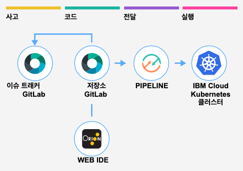

# IBM Cloud DevOps로 하이브리드 클라우드에 Kubernetes 앱 배포

---

## 퍼블릭 클라우드와 프라이빗 클라우드의 Kubernetes 환경에 앱 배포


이 튜토리얼의 툴체인에는 GitLab 소스 저장소 및 이슈 트래커, Orion Web IDE, 딜리버리 파이프라인이 포함되어 있습니다. 딜리버리 파이프라인은 IBM Cloud Kubernetes Service (IKS)에 스테이징 앱을 배포하고, 프라이빗 환경에서 있는 Kubernetes 클러스터에 프로덕션 앱을 배포합니다. 이 튜토리얼에서는 프라이빗 환경으로의 앱 배포를 위해 Delivery Private Pipeline Worker를 사용하는 과정을 소개합니다.





앱 코드는 Dockerfile 및 Kubernetes 배포 스크립트와 함께 Git 리포지토리 ([hello-containers](https://github.com/jeongkm/hello-containers))에 저장됩니다.
앱 배포 대상 클러스터는 툴체인 설정 중에 지정합니다. (IBM Cloud API 키 및 K8s 클러스터 이름 사용). 딜리버리 파이프라인 구성에서 이를 변경할 수 있습니다.
Git 리포지토리에 대한 모든 코드 변경은 Kubernetes 클러스터에 자동으로 구축, 검증 및 배포됩니다.


---

## 사전 작업


### IBM Cloud 가입

튜토리얼에서 사용되는 IBM Kubernetes 무료 클러스터를 생성하려면 IBM Cloud 계정이 있어야 합니다. 

- [IBM Cloud 가입](https://cloud.ibm.com/registration)


### IBM Kubernetes 무료 클러스터 생성

IBM Cloud에서 [Kubernetes Cluster 생성 페이지](https://cloud.ibm.com/kubernetes/catalog/create)로 이동합니다. 

1. 무료 플랜을 선택하고, 클러스터 이름을 입력합니다. 기본값은 mycluster-free 입니다.
   - [무료 및 표준 클러스터 비교](https://cloud.ibm.com/docs/containers?topic=containers-cs_ov&locale=ko#cluster_types)
2. 만들기 버튼을 클릭해 클러스터 생성을 시작합니다. 클러스터 생성이 완료되기 까지 10분 이상 소요됩니다. 
   - [Kubernetes 클러스터 작성 튜토리얼](https://cloud.ibm.com/docs/containers?topic=containers-cs_cluster_tutorial&locale=ko#cs_cluster_tutorial)

3. 클러스터 생성이 진행되는 동안, mycluster-free 클러스터 상세 정보의 액세스 탭을 참고해 IBM CLI 도구를 설치합니다. 

   


### IBM Registry에 네임스페이스 생성

IBM Registry는 IBM Kubernetes Service와 같이 사용되는 도커 이미지 레지스트리입니다. IBM Registry 페이지에 접근해 [**빠른 시작**](https://cloud.ibm.com/kubernetes/registry/main/start) 가이드에 따라 Container Registry 플러그인을 설치하고, 튜토리얼에서 사용할 레지스트리의 네임스페이스를 생성합니다. 

1. 댈러스, 시드니 등 레지스트리가 호스팅될 위치를 선택하세요.

2. 가이드를 참고해 플러그인 설치, 네임스페이스 생성, 이미지 푸시 등을 실행하세요.

   


### Docker Desktop 및 Kubernetes 클러스터 정보 확인

이 튜토리얼에서는 프라이빗 Kubernetes 클러스터 환경으로 개인용 랩탑을 사용합니다.  [Docker Desktop을 설치](https://www.docker.com/products/docker-desktop)하고, Docker UI에서 [Kubernetes 기능을 활성화](https://docs.docker.com/docker-for-windows/kubernetes/)시킵니다. 로컬 Kubernetes 환경 구성을 준비하고 튜토리얼 진행에 필요한 정보를 확인합니다.

1. kubectl 명령어의 컨텍스트가 로컬 Kubernetes 클러스터를 지정하도록 설정합니다. 명령어는 bash shell (리눅스)나 PowerShell (윈도우)에서 실행합니다.

   ```bash
   $ kubectl config set-context docker-desktop
   ```

   

2. Kuberenets Master의 도메인과 포트 번호를 확인합니다.

   - 도메인 : kubernetes.docker.internal
   - 포트 : 6443

   ```bash
   kubectl cluster-info
   
   # 아래는 명령어 실행 결과입니다.
   Kubernetes master is running at https://kubernetes.docker.internal:6443
   KubeDNS is running at https://kubernetes.docker.internal:6443/api/v1/namespaces/kube-system/services/kube-dns:dns/proxy
   ```

   

3. 이 튜토리얼에서는 로컬 Kubernetes 클러스터를 프로덕션 환경으로 사용합니다. 클러스터에 프로덕션 용 네임스페이스를 prod 라는 이름으로 생성합니다.

   ```bash
   kubectl create namespace prod
   ```

   

4. 로컬 Kubernetes 클러스터에 앱을 배포할 때 사용할 서비스 어카운트 토큰 (Service Account Token)을 확인합니다. 

   ```bash
   SERVICE_ACCOUNT_NAME=default
   CLUSTER_NAMESPACE=prod
   SECRET_NAME=$(kubectl get sa "${SERVICE_ACCOUNT_NAME}" --namespace="${CLUSTER_NAMESPACE}" -o json | jq -r .secrets[0].name)
   SERVICE_ACCOUNT_TOKEN=$(kubectl get secret ${SECRET_NAME} --namespace ${CLUSTER_NAMESPACE} -o jsonpath={.data.token} | base64 -d)
   echo ${SERVICE_ACCOUNT_TOKEN}
   ```

   - MacOS zsh 사용자는 bash shell로 위 명령어를 실행하세요.

   

5. (선택사항) 로컬 Kubernetes에 대시보드 UI를 설치합니다. 

   ```shell
   kubectl apply -f https://raw.githubusercontent.com/kubernetes/dashboard/v2.0.0/aio/deploy/recommended.yaml
   kubectl proxy &
   ```

   - [Kubernetes 대시보드 설치]()
   - UI 주소 :  http://localhost:8001/api/v1/namespaces/kubernetes-dashboard/services/https:kubernetes-dashboard:/proxy/
     - 로그인할 때 4번 단계에서 확인한 서비스 어카운트 토큰을 입력하세요.


---


## 툴체인 시작


툴체인을 시작하려면 이 버튼을 클릭하세요

[](https://cloud.ibm.com/devops/setup/deploy?repository=https%3A%2F%2Fgithub.com%2Fjeongkm%2Fhybrid-kube-toolchain&env_id=ibm:yp:us-south)


### 툴체인 구성

- 툴체인 이름 변경
- 도구 통합 : Git 저장소 및 문제 추적
  - 저장소 이름 변경 => Delivery PIpeline에서 앱 이름으로 사용됨
- 도구 통합 : Delivery Pipeline
  - IBM Cloud API 키 생성 - App 이름 + apices
  - 프로덕션 정보 설정 : 마스터 API 주소, 포트
  - 프로덕션 서비스 어카운트 토큰 설정 
- 추가 도구


### 툴체인  확인

- Git Issues
- Git Repos
- Orion Web IDE
- Delivery Pipeline
  - 배포 실패


 		ㅇ 로그 히스토리 보기


## PPW 도구 구성


### PPW 도구 추가


통합 이름: hybrid-toolchain-smile-private-worker

새 서비스 ID API 키 작성 : hybrid-toolchain-smile-service-id

비밀번호 표시 : d7zBvmH65BuOd4WMaeYSMUeojOmCUrMA2p8kWtrqHL0Z

통합 작성


### 개인용 작업자 설정 및 구성

시작하기


### PW 설치

1. 개인용 작업자 지원 설치
2. 클러스터에 새 작업자 등록
   1. kubectl apply --filename "https://private-worker-service.us-south.devops.cloud.ibm.com/install/worker?serviceId=ServiceId-c39c93c6-67fb-488b-9622-7b50f7b432f8&apikey=UEJZglcD4hB9qtDBHtOtiYCkD2PG8mQB2z1E4cPy7c34&name=hybrid-toolchain-smile-private-worker"
3. 클러스터에 작업자가 작성되었는지 확인


### PW 확인


## 프로덕션 배포 구성


### 작업자 변경


### 배포 재시작


## Learn more

- GitLab Issues and Repo 
- Orion Web IDE 
- Delivery Pipeline 각 단계 구성 확인, 스크립트 내용 확인
- OpenToolchain 
- OpenToolchain 커스터마이제이션
- Kubernetes Dash board - tekton-pipeline 확인
- OCP 클러스터에 프라이빗 파이프라인 워커 설치
- 테크톤 파이프라인 yaml 분석
- 원문 : https://www.ibm.com/cloud/architecture/tutorials/devops-toolchain-integration

