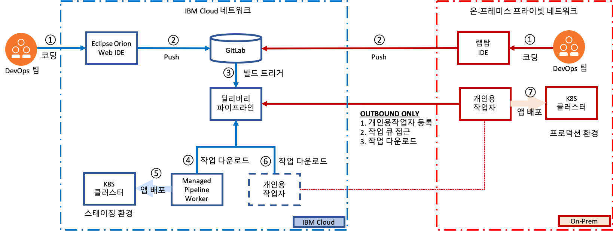
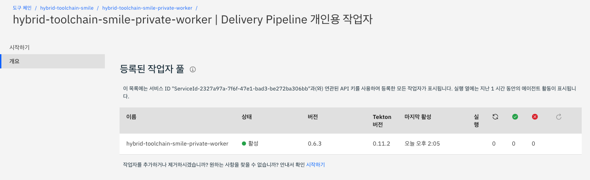
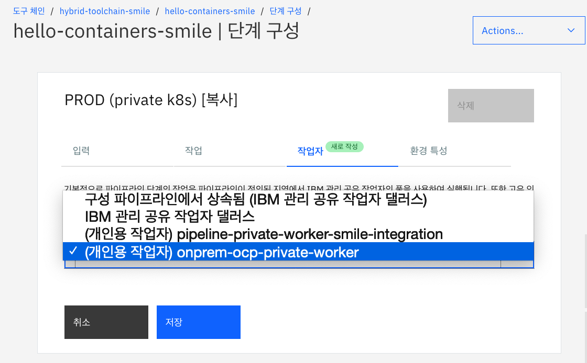

# IBM Cloud DevOps로 온-프레미스 Kubernetes 클러스터에 앱  배포

IBM Cloud Continuous Delivery 서비스와 Delivery Pipeline Private Worker를 활용하면 프로덕션 환경이 어디에 있든지 상관 없습니다. 프로젝트 팀은 퍼블릭 클라우드에서 DevOps 환경을 몇 분 이내에 구축해 개발과 테스트를 일찍 시작하고 (①②③), IBM Cloud과 다른 퍼블릭 클라우드(④⑤) 또는 인바운트 트래픽이 차단된 기업 내부 네트워크 환경에도 앱을 배포할 수 있습니다(⑥⑦). 





이 튜토리얼에서는 온-프레미스의 Kubernetes 클러스터 용도로 Docker Desktop의 Kubernetes와 프라이빗 네트워크의 OpenShift Container Platform 클러스터에 앱을 배포하는 과정을 소개합니다. 

[IBM Cloud Continuous Delivery 서비스](https://cloud.ibm.com/catalog/services/continuous-delivery#about)에서 제공하는 GitLab, Web IDE, 딜리버리 파이프라인, Delivery Pipeline Private Worker로 구성된 오픈 툴체인을 통해 Hello World node.js 앱을 네트워크 격리된 Kubernetes 환경에 배포합니다. 


앱 코드는 Dockerfile 및 Kubernetes 배포 스크립트와 함께 퍼블릭 Git 리포지토리 ([hello-containers](https://github.com/jeongkm/hello-containers))에서 관리하고 앱 배포 대상 Kubernetes 클러스터는 툴체인 설정 중에 지정합니다. (IBM Cloud API 키 및 K8s 클러스터 이름 사용). 딜리버리 파이프라인 구성에서 이를 변경할 수도 있습니다. Git 리포지토리에 대한 모든 코드 변경은 딜리버리 파이프라인 실행을 트리거하고 Kubernetes 클러스터에 자동으로 빌드, 검증 및 배포됩니다.


---

## 목차


 [사전 작업](#사전-작업)

- [IBM Cloud 가입](#ibm-cloud-가입) 
- [IBM Cloud 계정 내 리소스 그룹 생성](#ibm-cloud-계정-내-리소스-그룹-생성)

- [IBM Kubernetes 무료 클러스터 생성](#ibm-kubernetes-무료-클러스터-생성)

- [IBM Registry에 네임스페이스 생성](#ibm-registry에-네임스페이스-생성)

-  [Docker Desktop의 Kubernetes 클러스터 정보 확인](#docker-desktop의-kubernetes-클러스터-정보-확인)

-  [(선택 사항) 프라이빗 네트워크의 OCP 클러스터 정보 확인](#선택-사항-프라이빗-네트워크의-ocp-클러스터-정보-확인)

 [툴체인 시작](#툴체인-시작)

- [툴체인 구성](#툴체인-구성)

- [툴체인  확인](#툴체인--확인)

[Delivery Pipeline Private Worker 구성](#delivery-pipeline-private-worker-구성)

-  [Private Worker 도구 통합 작성](#private-worker-도구-통합-작성)

[프로덕션 배포 단계 구성](#프로덕션-배포-단계-구성)

-  [단계 구성 열기](#단계-구성-열기)

- [작업자 변경](#작업자-변경)

- [배포 재시작](#배포-재시작)

- [(선택 사항) OpenShift Container Platform 클러스터에 앱 배포](#선택-사항-openshift-container-platform-클러스터에-앱-배포)

[요약](#요약)

[참고](#참고)


---


## 사전 작업


### IBM Cloud 가입

튜토리얼에서 사용되는 IBM Kubernetes 무료 클러스터를 생성하려면 IBM Cloud 계정이 있어야 합니다. 

- [IBM Cloud 가입](https://cloud.ibm.com/registration)


### IBM Cloud 계정 내 리소스 그룹 생성

IBM Kubernetes 클러스터, 툴체인 등 IBM Cloud 내 서비스 인스턴스들은 리소스 그룹과 연결되는 리소스입니다. 리소스 그룹은 사용자가 직접 관리하는 권한 그룹으로 한 번에 2개 이상의 리소스에 대한 사용자 액세스를 정의할 수 있는 방법입니다. IBM Cloud Identity and Access Management (IAM) 액세스 제어를 사용해 관리되는 모든 계정 리소스는 계정 내의 리소스 그룹에 속합니다. 튜토리얼에서 생성하는 리소스를 포함시킬 리소스 그룹을 작성하세요.

- 메뉴 위치 : 관리 > 계정 > [리소스 그룹](https://cloud.ibm.com/account/resource-groups)
- 모든 계정에는 default 라는 이름의 리소스 그룹이 이미 생성되어 있습니다.


### IBM Kubernetes 무료 클러스터 생성

IBM Cloud에서 [Kubernetes Cluster 생성 페이지](https://cloud.ibm.com/kubernetes/catalog/create)로 이동합니다. 

1. 무료 플랜을 선택하고, 클러스터 이름을 입력합니다. 기본값은 mycluster-free 입니다.
   
   - [무료 및 표준 클러스터 비교](https://cloud.ibm.com/docs/containers?topic=containers-cs_ov&locale=ko#cluster_types)
2. 만들기 버튼을 클릭해 클러스터 생성을 시작합니다. 클러스터 생성이 완료되기 까지 10분 이상 소요됩니다. 
   
- [Kubernetes 클러스터 작성 튜토리얼](https://cloud.ibm.com/docs/containers?topic=containers-cs_cluster_tutorial&locale=ko#cs_cluster_tutorial)
  
3. 클러스터 생성이 진행되는 동안, mycluster-free 클러스터 상세 정보의 액세스 탭을 참고해 IBM CLI 도구를 설치합니다. 

   


### IBM Registry에 네임스페이스 생성

IBM Registry는 IBM Kubernetes Service와 같이 사용되는 도커 이미지 레지스트리입니다. IBM Registry 페이지에 접근해 [**빠른 시작**](https://cloud.ibm.com/kubernetes/registry/main/start) 가이드에 따라 Container Registry 플러그인을 설치하고, 튜토리얼에서 사용할 레지스트리의 네임스페이스를 생성합니다. 

1. 댈러스, 시드니 등 레지스트리가 호스팅될 위치를 선택하세요.

2. 가이드를 참고해 플러그인 설치, 네임스페이스 생성, 이미지 푸시 등을 실행하세요.

   


### Docker Desktop의 Kubernetes 클러스터 정보 확인

이 튜토리얼에서는 프라이빗 Kubernetes 클러스터 환경으로 개인용 랩탑을 사용합니다.  [Docker Desktop을 설치](https://www.docker.com/products/docker-desktop)하고, Docker UI에서 [Kubernetes 기능을 활성화](https://docs.docker.com/docker-for-windows/kubernetes/)시킵니다. 로컬 Kubernetes 환경 구성을 준비하고 튜토리얼 진행에 필요한 정보를 확인합니다.

1. kubectl 명령어의 컨텍스트가 로컬 Kubernetes 클러스터를 지정하도록 설정합니다. 명령어는 bash shell (리눅스)나 PowerShell (윈도우)에서 실행합니다.

   ```bash
   $ kubectl config set-context docker-desktop
   ```

   

2. Kuberenets Master의 도메인과 포트 번호를 확인합니다.

   - 도메인 : kubernetes.docker.internal
   - 포트 : 6443

   ```bash
   kubectl cluster-info
   
   # 아래는 명령어 실행 결과입니다.
   Kubernetes master is running at https://kubernetes.docker.internal:6443
   KubeDNS is running at https://kubernetes.docker.internal:6443/api/v1/namespaces/kube-system/services/kube-dns:dns/proxy
   ```

   

3. 이 튜토리얼에서는 로컬 Kubernetes 클러스터를 프로덕션 환경으로 사용합니다. 클러스터에 프로덕션 용 네임스페이스를 prod 라는 이름으로 생성합니다.

   ```bash
   kubectl create namespace prod
   ```

   

4. 로컬 Kubernetes 클러스터에 앱을 배포할 때 사용할 서비스 어카운트 토큰 (Service Account Token)을 확인합니다. 

   ```bash
   SERVICE_ACCOUNT_NAME=default
   CLUSTER_NAMESPACE=prod
   SECRET_NAME=$(kubectl get sa "${SERVICE_ACCOUNT_NAME}" --namespace="${CLUSTER_NAMESPACE}" -o json | jq -r .secrets[0].name)
   SERVICE_ACCOUNT_TOKEN=$(kubectl get secret ${SECRET_NAME} --namespace ${CLUSTER_NAMESPACE} -o jsonpath={.data.token} | base64 -d)
   echo ${SERVICE_ACCOUNT_TOKEN}
   ```

   - MacOS zsh 사용자는 bash shell로 위 명령어를 실행하세요.

   

5. (선택 사항) 로컬 Kubernetes에 대시보드 UI를 설치합니다. 

   ```shell
   kubectl apply -f https://raw.githubusercontent.com/kubernetes/dashboard/v2.0.0/aio/deploy/recommended.yaml
   kubectl proxy &
   ```

   - [Kubernetes 대시보드 설치]()
   - UI 주소 :  http://localhost:8001/api/v1/namespaces/kubernetes-dashboard/services/https:kubernetes-dashboard:/proxy/
     - 로그인할 때 4번 단계에서 확인한 서비스 어카운트 토큰을 입력하세요.


### (선택 사항) 프라이빗 네트워크의 OCP 클러스터 정보 확인

프라이빗 Kubernetes 클러스터 환경으로 RedHat OpenShift Container Platform을 사용합니다. 테스트 용도로 랩탑에 [MiniShift](https://www.okd.io/minishift/)나 [RedHat](https://www.openshift.com/try)이 제공하는 무료 클러스터를 이용하셔도 됩니다. 단, Private Worker를 설치하시려면 [Kubernetes 클러스터 버전 1.15 이상](https://cloud.ibm.com/docs/ContinuousDelivery?topic=ContinuousDelivery-install-private-workers#pw_install_prereqs)이 필요합니다.

1. OCP 클러스터에 접근 가능한 작업 환경의 CLI에서 Login Command를 입력해 로그인합니다.

   ```bash
   oc login --token=<token> --server=https://<OCP MASTER URL>:6443
   ```

   

2. OCP Master의 도메인과 포트 번호를 확인합니다.

   - 도메인 : api.openshift.ibm.com
   - 포트 : 6443

   ```bash
   oc cluster-info
   
   # 아래는 명령어 실행 결과입니다.
   Kubernetes master is running at https://api.openshift.ibm.com:6443
   To further debug and diagnose cluster problems, use 'kubectl cluster-info dump'
   ```

   

3. 클러스터에 프로덕션 용 프로젝트를 ocp-prod 라는 이름으로 생성합니다.

   ```bash
   oc new-project ocp-prod
   ```

   

4. OCP 클러스터에 앱을 배포할 때 사용할 서비스 어카운트 토큰 (Service Account Token)을 확인하고, default 서비스 어카운트에 admin 권한을 부여합니다. 

   ```bash
   CLUSTER_NAMESPACE=ocp-prod
   SERVICE_ACCOUNT_NAME=default
   oc project ${CLUSTER_NAMESPACE}
   SERVICE_ACCOUNT_TOKEN=$(oc serviceaccounts get-token $SERVICE_ACCOUNT_NAME)
   echo ${SERVICE_ACCOUNT_TOKEN}
   
   oc create rolebinding cd-admin --clusterrole=admin --serviceaccount=${CLUSTER_NAMESPACE}:${SERVICE_ACCOUNT_NAME} --namespace=${CLUSTER_NAMESPACE}
   ```

   

---


## 툴체인 시작


이 버튼을 클릭하면 이 튜토리얼을 진행하기 위해 커스터마이즈된 툴체인을 생성하는 페이지로 이동합니다.

[](https://cloud.ibm.com/devops/setup/deploy?repository=https%3A%2F%2Fgithub.com%2Fjeongkm%2Fhybrid-kube-toolchain&env_id=ibm:yp:us-south)


생성될 툴체인에 대한 설명입니다. 앱 배포 요건에 따라 GitHub, Jenkins, SonarQube, Nexus, PagerDuty, Slack 등 다양한 CI/CD 툴들을 오픈 툴체인으로 통합 구성할 수 있습니다. 


- 툴체인에 포함된 Vulnerability Advisor에 대한 내용은 이 튜토리얼 [Use the "Develop a Kubernetes app toolchain"](https://www.ibm.com/cloud/architecture/tutorials/use-develop-kubernetes-app-toolchain?task=8)을 참고하세요.

  

### 툴체인 구성


1. 툴체인 이름을 변경하고, 툴체인 인스턴스가 배치될 지역, 리소스 그룹을 선택합니다.

   

   

2. 이 튜토리얼에서는 소스 제공자로 IBM Continuous Delivery Service에 포함되어 있는 GitLab 기반의 Git 저장소 및 문제 추적 (Git Repos and Issues)를 사용합니다.  GitHub, Enterprise GitHub, GitLab, Bitbucket 등 다른 Git 서버를 사용해도 됩니다. 

   - 저장소 이름을 변경합니다. 저장소 이름은 Delivery Pipeline 구성 단계에서 애플리케이션 이름으로도 상요됩니다. 

   

   

3. Delivery Pipeline 탭에서 IBM Cloud API 키 항목의 신규 버튼을 클릭해 새 API 키를 작성합니다. 생성된 API 키는 다시 확인할 수 없으니 따로 기록해두세요.

   - IBM Cloud API 키 : 예) 6KwKjrSbgFXDF6gdBl6Dr_67zHYs0bCNcgXRuNzGbazv 


4. Delivery Pipeline 탭에서 IBM Cloud API 키가 생성되면 사용자 계정의 Kubernetes 클러스터에 대한 정보가 스테이징 단계에 자동 입력됩니다. 

   - 프로덕션 단계의 클러스터 정보에는 "Docker Desktop 및 Kubernetes 클러스터 정보 확인" 단계에서 기록해 둔 마스터 도메인과 포트 번호, 서비스 어카운트 토큰을 입력합니다.

   

   

5. 추가 도구 탭에서는 Eclipse Orion Web IDE 정보를 볼 수 있습니다. Web IDE는 툴체인 생성 이후에 접근이 가능합니다.

6. 작성 버튼을 클릭해 툴체인 인스턴스를 생성합니다.

   


### 툴체인  확인

1. 툴체인 개요 페이지에서 Issues, GIT, Eclipse Orion Web IDE 카드를 각각 클릭해 별도의 탭으로 띄운 다음 살펴봅니다.

2. Delivery Pipeline 카드를 열어 파이프라인 실행 상황을 확인합니다. 각 단계(Stage)의 로그 및 히스토리 보기를 열면 각 작업(Task)의 실행 내용을 볼 수 있습니다. 

   


3. PROD (private) 단계의 실패 원인을 확인하기 위해 "Deploy to Kubernetes" 작업의 로그를 확인합니다. 로그 섹션에서 배포 대상 앱의 이미지 이름과 타겟 클러스터에 대한 접속 정보를 확인할 수 있습니다. 

   

   

   - 로그 마지막 부분에서 Unable to connect to the server: dial tcp: lookup kubernetes.docker.internal on 172.21.0.10:53: no such host 라는 메시지를 통해 Delivery Pipeline 서버에서 타겟 클러스터에 접속할 수 없기 때문에 배포 작업이 실패했다는 것을 알 수 있습니다. 다음 단계에서 이 문제를 해결할 수 있는 Delivery Pipeline Private Worker를 구성합니다.

​	


---


## Delivery Pipeline Private Worker 구성


Delivery Pipeline 개인용 작업자 도구 통합은 네트워크 격리 상태에서 Delivery Pipeline 워크로드를 실행할 수 있는 하나 이상의 개인용 작업자와 연결됩니다. 자세한 정보는 [Private Worker에 대한 작업](https://cloud.ibm.com/docs/services/ContinuousDelivery?topic=ContinuousDelivery-private-workers)을 참조하세요. Delivery Pipeline 단계가 실행될 위치를 지정할 때, '통합 이름'은 사용할 개인용 작업자 도구 통합를 식별할 수 있게 해 줍니다. 서비스 ID API 키는 하나 이상의 개인용 작업자가 Delivery Pipeline의 작업 큐에 접근할 때 인증하는데 사용합니다. 

### Private Worker 도구 통합 작성

1. 툴체인 개요 페이지에서 도구 추가 버튼을 클릭하고, Delivery Pipeline 개인용 작업자를 추가합니다.

   

   

2.  개인용 작업자의 통합 이름과 서비스 ID API 키를 입력합니다. 서비스 ID API 키는 신규 버튼을 클릭해 새로 작성하고, 생성 후에 반드시 별도로 기록해둡니다. 입력이 완료되면 통합 작성 버튼을 클릭합니다.

   - 서비스 ID API 키 : 예) UPYx-stUyY5CRYa0xxgdSR2EiISU0Apn8UWkPODAlhEH

   

   

3.  Delivery Pipeline 개인용 작업자 도구 통합이 툴체인에 추가되었습니다. 개인용 작업자 카드를 클릭해 설정 화면으로 이동합니다.

   

   

4. 개인용 작업자 설정 및 구성을 위해 2단계에서 확인한 서비스 ID API 키를 입력하고 제출 버튼을 클릭합니다.

   

   

5. **개인용 작업자 새로 추가** 섹션의 명령어를 로컬 Kubernetes에 대해 실행합니다. 

    

   - 개인용 작업자가 정상적으로 설치됐을 경우, 아래와 같은 상태(등록 성공, 버전/인증 정상)를 확인할 수 있습니다.

     ```bash
     kubectl get workeragent
     
     # 아래는 실행 결과입니다. 
     NAME                                    SERVICEID                                        REGISTERED   VERSION   AUTH
     hybrid-toolchain-smile-private-worker   ServiceId-2327a97a-7f6f-47e1-bad3-be272ba306bb   Succeeded    OK        OK
     ```

     

6. Delivery Pipeline 개인용 작업자의 개요 페이지에서 등록된 작업자를 확인할 수 있습니다.

   

    

7. 개인용 작업자는 외부에서 접근이 불가하고 인터넷 접근을 가능한 (Inbound block, Outbound allow) 프라이빗 네트워크에서 일정 주기로 IBM Cloud Delivery Pipeline의 작업 큐에 접근해 CI/CD 태스크를 다운로드 받아 실행합니다. 


---


## 프로덕션 배포 단계 구성


딜리버리 파이프라인의 PROD (private) 단계 구성을 열어 개인용 작업자를 작업자로 지정하고, 실패한 배포 작업을 재실행합니다.


### 단계 구성 열기

실패했던 PROD (private) 단계의 단계 구성 메뉴를 클릭합니다.


### 작업자 변경

로컬 환경에 위치한 개인용 작업자의 이름을 선택하고 저장합니다.


### 배포 재시작

1. PROD (private) 단계의 **단계 실행 아이콘**을 클릭합니다.

   


2. Deploy to Kubernetes 작업의 완료되면 로그에서 배포 결과를 확인합니다.

   

   

3.  배포된 앱의 웹 페이지를 확인합니다.

   

---


## (선택 사항) OpenShift Container Platform 클러스터에 앱 배포


OCP 클러스터에 설치할 Delivery Pipeline 개인용 작업자 도구 통합을 추가하고, OPC 클러스터에 Private Worker를 설치합니다. 그런 다음 기존 딜리버리 파이프라인에 OCP 클러스터로 앱을 배포하는 단계를 추가합니다.


1. [Private Worker 도구 통합 작성](#delivery-pipeline-private-worker-구성) 과 같은 방식으로 개인용 작업자를 추가합니다. 

2. 개인용 작업자 생성 후, 서비스 ID API 키와 Worker Name 를 입력해 설치 명령어를 확인합니다.

   


3. OpenShift는 컨테이너 엔진으로 Docker대신 [CRI-O](https://cri-o.io/)를 사용합니다. CRI-O는 이미지 풀링 시, 이미지 태그와 다이제스트 중 하나만 사용해야 합니다. 이 [문서](https://github.com/tektoncd/pipeline/blob/master/docs/install.md)를 참고하세요. 이 튜토리얼에서는 Deployment.yaml에 포함된 이미지 이름에서 다이제스트를 모두 제거한 뒤, Private Worker CRD (Custom Resource Definition)을 생성합니다.

   ```bash
   wget https://private-worker-service.us-south.devops.cloud.ibm.com/install
   vi install
   
   # 아래의 정규표현식을 적용해 다이제스트를 모두 제거합니다.
   # %s/@sha256:[a-z0-9]*//g
   
   # 이미지 이름 예: gcr.io/tekton-releases/github.com/tektoncd/pipeline/cmd/controller:v0.11.2@sha256:0791513ec1176da38c403eb81220406e987f78f3e58608bd57be1adc45bc9aac
   
   # 다이제스트 제거 결과 : gcr.io/tekton-releases/github.com/tektoncd/pipeline/cmd/controller:v0.11.2
   ```

   

4. Private Worker CRD를 설치하고, 새 작업자를 등록합니다.

   ```bash
   oc apply --filename install
   
   oc adm policy add-scc-to-user anyuid system:serviceaccount:tekton-pipelines:tekton-pipelines-controller
   
   oc project tekton-pipelines
   
   oc apply --filename "https://private-worker-service.us-south.devops.cloud.ibm.com/install/worker?serviceId=<service-id>&apikey=<apikey>&name=<worker name>"
   
   oc get workeragent
   ```

   

5. IBM Cloud 개인용 작업자 개요 페이지에서 등록된 작업자 풀에 위에서 등록한 작업자 이름을 확인합니다.

6. 딜리버리 파이프라인의 PROD 배포 단계를 복제해 OCP 용 PROD 배포 단계를 구성합니다.

   


7. PROD 단계 구성에서 작업자를 새로운 개인용 작업자로 변경합니다.




8. PROD 단계 구성-환경 특성에서 Cluster Namespace, Master Address, Service Account Token를 변경합니다.

   

   

9. 새로 추가된 PROD 단계를 시작합니다.

   


10. 배포된 앱의 웹 페이지를 확인합니다.

    


## 요약

이 튜토리얼에서 Hello World  앱을 퍼블릭 클라우드와 프라이빗 클라우드의 Kubernetes 클러스터에 배포하는 툴체인을 만들었습니다. 그리고 Delivery Pipeline Private Worker (개인용 작업자)를 격리된 네트워크 환경의 Kubernetes 클러스터에 설치해 프로덕션 앱 배포에 성공했습니다. 


## 참고

- 튜토리얼 원문 : https://www.ibm.com/cloud/architecture/tutorials/devops-toolchain-integration

- Delivery Pipeline Private Worker 설치 : https://cloud.ibm.com/docs/ContinuousDelivery?topic=ContinuousDelivery-install-private-workers#open_shift_pw_

- IBM Cloud Continuous Delivery 소개 : https://www.ibm.com/kr-ko/cloud/continuous-delivery

- Continuous Delivery 시작하기 : https://cloud.ibm.com/docs/ContinuousDelivery?topic=ContinuousDelivery-getting-started

- Open Toolchain Github : https://github.com/open-toolchain

  
